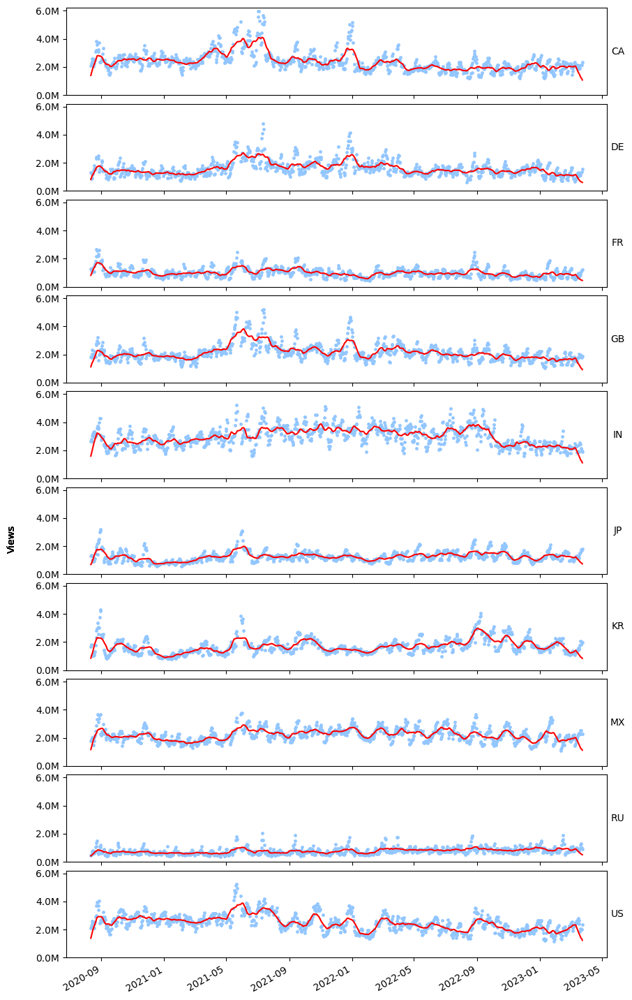
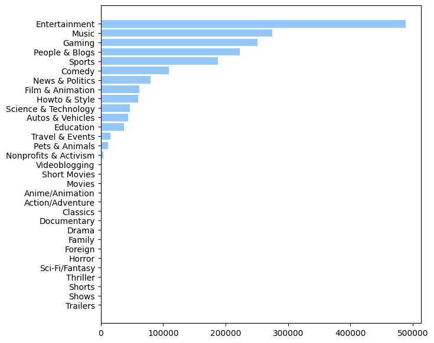
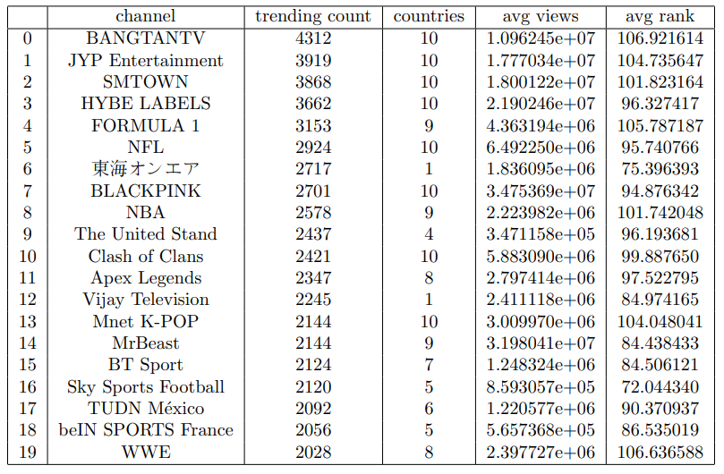
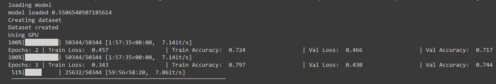

<p align="center">
  
</p>
<p align="center">
    <h1 align="center">YouTube Trending Video Analysis</h1>
</p>
<p align="center">
    <em><code>"YouTube trending videos: where cat videos and conspiracy theories live in perfect harmony."</code></em>
</p>
<p align="center">
	
	
	
<p>
<p align="center">
		<em>Developed with the software and tools below.</em>
</p>
<p align="center">
	
    
	
	
    
    


</p>
<hr>

## 🔗 Quick Links

> - [📍 Overview](#overview)
> - [📦 Features](#features)
> - [📂 Repository Structure](#repository-structure)
> - [🧩 Modules](#modules)
> - [🤖 Analysis](#analysis)
> - [🤖 BERT Training](#bert-training)
> - [🛠 Project Roadmap](#project-roadmap)
> - [👏 Acknowledgments](#acknowledgments)

---

## 📍 Overview

This project delves into the comprehensive analysis of YouTube trending videos spanning from August 12, 2020, onwards. We establish an efficient data ingestion pipeline leveraging the `YouTube API` to collect trending video data regularly. Storing this data in a managed `Microsoft Azure` instance within a `Docker` container ensures scalability and seamless management.

The analysis focuses on understanding viewer behavior during the COVID-19 pandemic, identifying prevalent video categories, and recognizing frequently appearing channels on the YouTube trending tab. Additionally, we employ  `BERT (Bidirectional Encoder Representations from Transformers)` to train a model that predicts video categories based on title content.

This project offers valuable insights into YouTube viewership trends and content categorization strategies.

---

## 📦 Features

<code>► INSERT-TEXT-HERE</code>

---

## 📂 Repository Structure

```sh
└── Youtube_trending_videos_analysis/
    ├── Analysis
    │   ├── Spotify Analysis Project.ipynb
    │   └── Youtube Trending Videos Analysis.ipynb
    ├── README.md
    ├── Youtube_data.ipynb
    ├── api_test.py
    ├── data_collect.ipynb
    ├── data_loader.py
    └── docker-compose.yaml
```

---

## 🧩 Modules


Here is the description of the data collection, loading, and api call files present in the project.

| File                                                                                                                    | Summary                         |
| ---                                                                                                                     | ---                             |
| [`Youtube_data.ipynb`](https://github.com/rohan-deswal/Youtube_trending_videos_analysis/blob/master/Youtube_data.ipynb)   |  This notebook aims to analyze YouTube video data from multiple countries by ingesting CSV files, preprocessing `datetime` columns, calculating the `time taken` for videos to trend, and visualizing the distribution of these time intervals. It first loads data from CSV files for ten countries, handling Unicode decoding errors if encountered, and then preprocesses the datetime columns `trending_date` and `publish_time` to calculate the time difference in hours. Finally, it creates a histogram to visualize the distribution of the time taken for videos to trend in the selected country `(here, India 'IN')`, providing insights into the popularity dynamics of trending videos in that region.|
| [`api_test.py`](https://github.com/rohan-deswal/Youtube_trending_videos_analysis/blob/master/api_test.py)| This Python code utilizes the `Google API` Client Library to fetch details about the most popular videos in India from the `YouTube Data API v3`. It sets up `OAuth 2.0` authentication, constructs a request for popular videos based on specific parameters, and retrieves the desired data, showcasing a basic implementation for programmatically accessing YouTube data in Python. |
| [`data_loader.py`](https://github.com/rohan-deswal/Youtube_trending_videos_analysis/blob/master/data_loader.py)           | This Python script uses the `YouTube Data API v3` to fetch details about popular videos in various countries using an API key. It then processes and uploads this data to a PostgreSQL database. The script iterates through a list of countries, retrieves video details, creates tables in the database, and uploads data accordingly. Adjust the database connection details and API key as needed before running the script. |
| [`data_collect.ipynb`](https://github.com/rohan-deswal/Youtube_trending_videos_analysis/blob/master/data_collect.ipynb)   | This notebook uses the `YouTube Data API v3` with an API key to fetch and upload information about popular videos in different countries to a `PostgreSQL` database. It includes functions to retrieve video categories, create dataframes for video details, and upload data to the database. The script iterates through a list of countries, processes video data, and uploads it to the database accordingly. Adjust API key and database connection details before running the script. |
| [`docker-compose.yaml`](https://github.com/rohan-deswal/Youtube_trending_videos_analysis/blob/master/docker-compose.yaml) | This configuration sets up a `PostgreSQL` database along with a `PGAdmin` interface for database management within `Docker` containers, providing a convenient and isolated environment for development or testing purposes. Adjustments can be made to environment variables, volumes, or ports as needed. |


Here is the description of the Analysis Jupyter Notebooks used in the project.
| File                                                                                                                                                                   | Summary                         |
| ---                                                                                                                                                                    | ---                             |
| [`Youtube Trending Videos Analysis.ipynb`](<https://github.com/rohan-deswal/Youtube_trending_videos_analysis/blob/master/Analysis/Youtube Trending Videos Analysis.ipynb>) | This Pynotebook script connects to a `PostgreSQL` database to analyze YouTube trending video data. It retrieves information about video categories and trending videos across different countries, visualizes trends in `video views`, and trains a `BERT`-based `classifier` to predict video categories from titles. The trained model achieves a test accuracy of approximately `75.4%`. |


---
## 🤖 Analysis

We have the capability to extract information regarding YouTube usage patterns across various countries during the specified time period, as illustrated below. The data clearly indicates that spikes in views for certain countries align directly with the imposition of lockdown restrictions in those regions. Additionally, we can infer that YouTube is primarily popular in English-speaking nations, given the notably lower view counts in countries such as Russia, Japan, and France in comparison to countries like Great Britain, the US, and India.


*Trend of views per day per country*

We can delve into an analysis of the most popular categories of YouTube videos, often featured on the YouTube trending page, as seen below. Notably, certain video categories do not feature any trending videos at all. This is due to YouTube discontinuing these categories, which now exist solely within the YouTube Data API for historical analysis of older YouTube video data.


*Frequency on the trending tab for different categories*

The table below reveals the top 20 trending YouTube channels, differing significantly from the most subscribed channels. This distinction is due to the direct link between trending video count and a channel's upload frequency. For example, popular Korean pop music channels and sports channels dominate this list because of their widespread appeal and frequent video uploads, which keep their content on the trending page for extended periods.


*Frequency on the trending tab for different categories*

---

## 🤖 BERT Training
The dataset consists of YouTube videos with user-selected category tags, serving as a labeled dataset for text classification. Our goal is to explore correlations between video titles and their category tags, leveraging the BERT multilingual model due to its support for 104 languages. Training initially on a CPU took 51 minutes per epoch for a sample dataset of 500 videos, while GPU acceleration on Google Colab enabled us to achieve a validation accuracy of 74.4% after training for 3 epochs, emphasizing the efficiency and accuracy benefits of GPU computing for large datasets.


*Model trained for 3 epochs with accuracy of 74.4%*

---
## 🛠 Project Roadmap

[x] `Create a PostgreSQL database in a Docker container on Microsoft Azure.`

[X] `Run a cloud function to query and store popular YouTube videos for ten regions.`

[X] `Develop an analysis script to derive insights from the stored data.`

[X] `Train a BERT-based model to categorize YouTube video titles accurately.`

---

## 👏 Acknowledgments

- Majority Youtube trending videos data taken from Rishav Sharma who has been tracking youtube trending videos since 2020 - [`https://www.kaggle.com/datasets/rsrishav/youtube-trending-video-dataset`](https://www.kaggle.com/datasets/rsrishav/youtube-trending-video-dataset)

- Hugging face BERT multilingual model - [`https://dblp.org/rec/journals/corr/abs-1810-04805.bib`](https://dblp.org/rec/journals/corr/abs-1810-04805.bib)

- DataTalksClub data engineering zoomcamp - [`https://youtube.com/playlist?list=PL3MmuxUbc_hJjEePXIdE-LVUx_1ZZjYGW`](https://youtube.com/playlist?list=PL3MmuxUbc_hJjEePXIdE-LVUx_1ZZjYGW)

- Microsoft Azure Virtual Machine introduction - [`https://learn.microsoft.com/en-us/azure/virtual-machines/`](https://learn.microsoft.com/en-us/azure/virtual-machines/)


---
